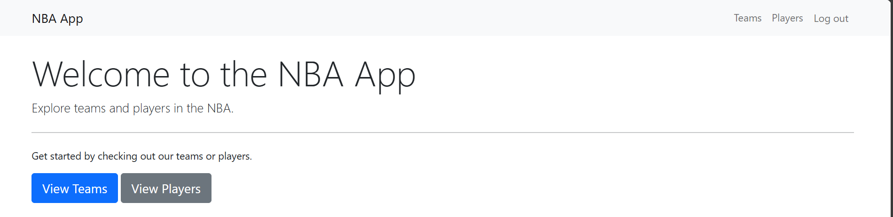
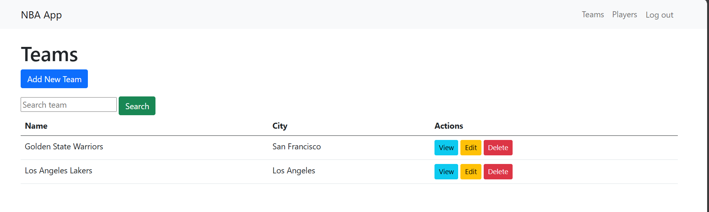
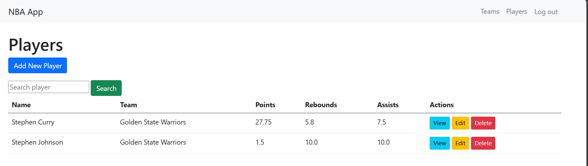

# Aplikasi Manajemen Tim dan Pemain NBA

## A. Penjelasan Proyek

Aplikasi ini adalah sistem manajemen sederhana sesuai hobi saya yaitu Basket. Aplikasi ini memungkinkan pengguna untuk melakukan operasi CRUD (Create, Read, Update, Delete) pada tim dan pemain NBA. Fitur utama aplikasi meliputi:

- Manajemen Tim: CRUD.
- Manajemen Pemain: CRUD.
- Pencarian pemain dan tim
- Hubungan One-to-Many: Setiap tim dapat memiliki banyak pemain.
- Antarmuka yang Responsif: Menggunakan Bootstrap untuk tampilan yang responsif.
- Penanganan Error: Implementasi try-catch dan transaksi database untuk penanganan error yang lebih baik.

## B. Desain Database

Aplikasi ini menggunakan dua tabel utama:

1. Tabel `teams`:
   - `id` (UUID): Primary key
   - `name` (string): Nama tim
   - `city` (string): Kota asal tim
   - `created_at` (timestamp): Waktu pembuatan record
   - `updated_at` (timestamp): Waktu terakhir update record

2. Tabel `players`:
   - `id` (UUID): Primary key
   - `name` (string): Nama pemain
   - `points` (integer): Jumlah poin
   - `rebounds` (integer): Jumlah rebound
   - `assists` (integer): Jumlah assist
   - `team_id` (UUID): Foreign key yang merujuk ke tabel teams
   - `created_at` (timestamp): Waktu pembuatan record
   - `updated_at` (timestamp): Waktu terakhir update record

.png)

## C. Screenshot Aplikasi

*Gambar 1: Halaman Utama Aplikasi*

*Gambar 2: Halaman Daftar Tim*

*Gambar 3: Halaman Detail Pemain*

## D. Dependency

Aplikasi ini dibangun menggunakan:

- PHP ^7.4
- Laravel 8
- Bootstrap 5.1

## E. Informasi Tambahan

1. Instalasi:
   - Clone repository ini
   - `composer install`
   - Salin `.env.example` ke `.env` dan sesuaikan konfigurasi database
   - `php artisan key:generate`
   - `php artisan migrate` untuk membuat tabel-tabel
     
2. Penggunaan UUID:
   - Proyek ini menggunakan UUID sebagai primary key. Pastikan untuk menggunakan `$table->uuid('id')->primary()` saat membuat migrasi baru.
